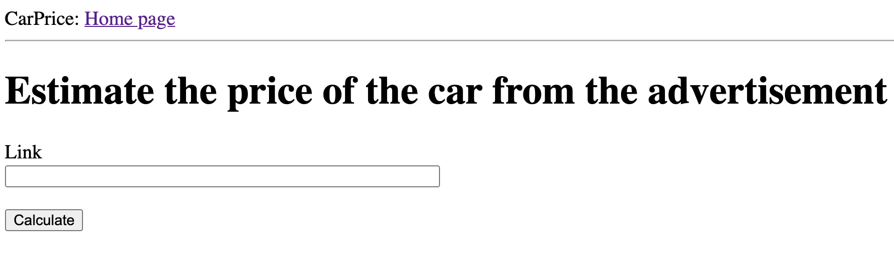

# CarPrice

This program was created to help with the valuation of the car from the [otomoto.pl](https://otomoto.pl)

---
## Table of content
* [General info](#General-info)
* [Screenshots](#Screenshots)
* [Usage](#Usage)
* [Installation](#Installation)
* [Technologies](#technologies)

## General info

The application evaluates the advertisement on the basis of the collected data ([scrap-otomoto](https://github.com/jedrzejd/scrap-otomoto)) and the model learned from this data ([cars_build_model](https://github.com/jedrzejd/cars_build_model)).

It is enough to provide a link to the advertisement. Will be displayed on the screen:
* link - which you provided
* price from the advertisement
* price proposed by the model

## Screenshots




## Usage

```python
python3 app.py
```
If app is starts open your web browser and paste the link `http://127.0.0.1:5000`

## Installation

```python
pip install -r requirements.txt
```

## Technologies

- Python 3.7
- beautifulsoup4
- requests
- Flask
